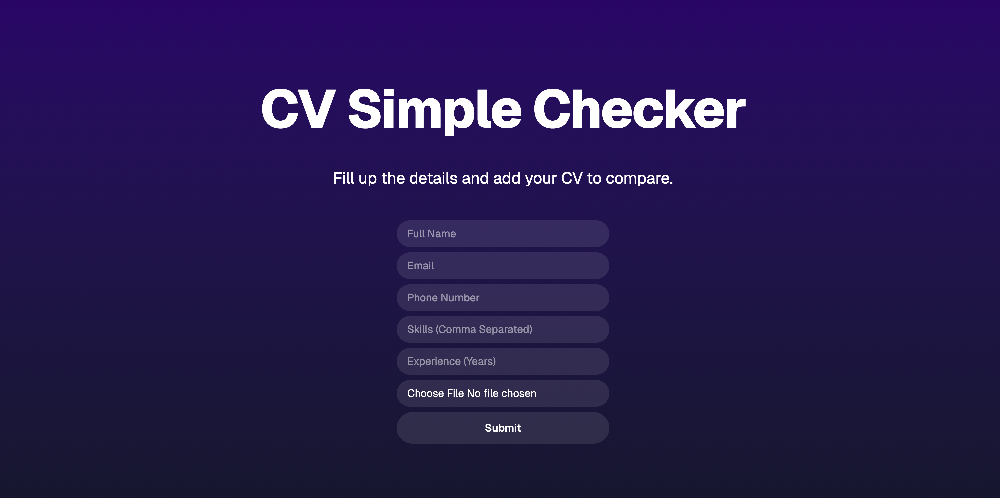
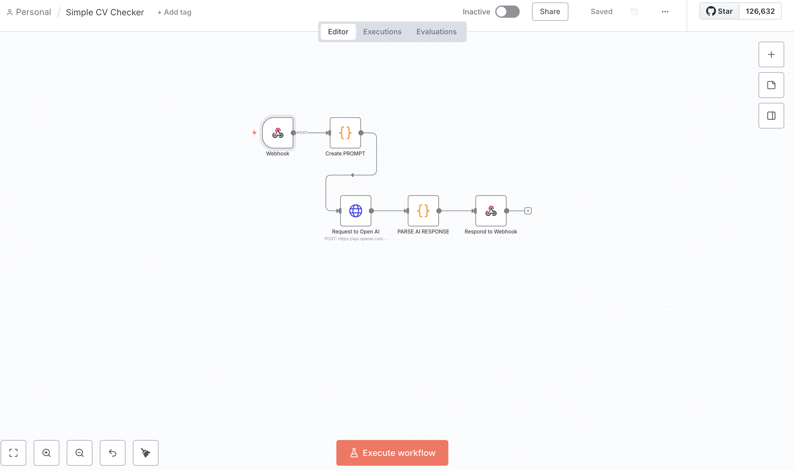

# CV Simple Checker Application

A full-stack Next.js application that validates user-entered CV data against uploaded PDF documents using AI.

## Screenshot
### Application

### N8N Workflow


## Features

- **Frontend**: Next.js/React with Tailwind CSS for a clean, responsive UI
- **Backend**: Node.js with tRPC for type-safe API endpoints
- **Database**: PostgreSQL with Prisma ORM
- **AI Validation**: OpenAI integration with n8n workflow to compare form data with CV content
- **File Upload**: PDF upload with validation and storage
- **Docker**: Complete containerized deployment setup

## Architecture

```
├── Frontend (Next.js/React)
│   ├── Form for user data entry
│   ├── PDF file upload
│   └── Validation results display
├── Backend (tRPC + Node.js)
│   ├── User data management
│   ├── File upload handling
│   └── AI validation service (with n8n workflow)
├── Database (PostgreSQL + Prisma)
│   ├── User data storage
│   └── Validation results
└── AI Service (OpenAI)
    └── CV content analysis and comparison
```

### Architecture Diagram

- **Editable Diagram (Excalidraw JSON):** [View](https://excalidraw.com/#json=vWzJ9-3jGuuoVJ_aM7X7p,17L0hpIsjb5dNDZzR-ZOhA)

---

## Prerequisites

- Node.js 18+
- Docker and Docker Compose
- OpenAI API key

## Quick Start with Docker

1. **Clone and setup environment**:

   ```bash
   git clone <your-repo>
   cd cv-simple-checker
   cp .env.example .env
   ```

2. **Configure environment variables**:
   Edit `.env` file and add your OpenAI API key:

   ```bash
   OPENAI_API_KEY=your-actual-openai-api-key
   ```

3. **Deploy with Docker**:

   ```bash
   docker-compose up -d --build
   ```

4. **Initialize database**:

   ```bash
   docker exec cv-simple-checker npx prisma db push
   ```

5. **Access the application**:
   Open http://localhost:3000

## Development Setup

1. **Install dependencies**:

   ```bash
   npm install
   ```

2. **Setup database**:

   ```bash
   npm run db:push
   ```

3. **Start development server**:
   ```bash
   npm run dev
   ```

## Project Structure

```
├── Dockerfile                   # Docker build instructions
├── docker-compose.yml           # Docker Compose setup
├── uploads/                     # Uploaded CV PDF files
└── src/
    ├── app/
    │   ├── _components/
    │   │   └── user.tsx             # User-related React component
    │   ├── api/
    │   │   ├── trpc/[trpc].ts       # tRPC API handler
    │   │   └── upload.ts            # File upload endpoint
    │   ├── layout.tsx               # App layout
    │   └── page.tsx                 # Main page
    ├── server/
    │   ├── api/
    │   │   ├── routers/
    │   │   │   └── user.ts          # User-related tRPC procedures
    │   │   ├── root.ts              # Main tRPC router
    │   │   └── trpc.ts              # tRPC configuration
    │   ├── services/
    │   │   └── cvValidator.ts       # AI validation service
    │   └── db.ts                    # Database configuration
    ├── trpc/
    │   ├── query-client.ts          # React Query client setup for tRPC
    │   └── index.ts                 # tRPC client exports
```

## API Endpoints

### tRPC Procedures

- `user.create` - Create new user with CV data
- `user.validateCV` - Validate form data against uploaded CV

### REST Endpoints

- `POST /api/upload` - Upload CV PDF files

## AI Validation Process

1. **PDF Parsing**: Extract text content from uploaded PDF
2. **Data Comparison**: Use OpenAI to compare form fields with CV content
3. **Validation Report**: Generate detailed match/mismatch results
4. **Storage**: Save validation results to database

The AI validation checks:

- Name matching (flexible formatting)
- Email verification (exact match)
- Phone number validation (flexible formatting)
- Skills presence in CV
- Experience consistency

## Database Schema

```sql
-- Users table
CREATE TABLE users (
    id TEXT PRIMARY KEY,
    fullName TEXT NOT NULL,
    email TEXT UNIQUE NOT NULL,
    phone TEXT,
    skills TEXT[],
    experience TEXT,
    cvFileName TEXT,
    cvFilePath TEXT,
    createdAt TIMESTAMP DEFAULT NOW(),
    updatedAt TIMESTAMP DEFAULT NOW()
);

```

## Environment Variables

| Variable         | Description                   | Required |
| ---------------- | ----------------------------- | -------- |
| `DATABASE_URL`   | PostgreSQL connection string  | Yes      |
| `OPENAI_API_KEY` | OpenAI API key for validation | Yes      |

## Docker Configuration

The application includes:

- **Multi-stage Dockerfile** for optimized production builds
- **composer.yml** with PostgreSQL and app services
- **Volume mounting** for file uploads
- **Network configuration** for service communication

## Security Features

- **File validation**: Only PDF files accepted
- **File size limits**: 5MB maximum upload size
- **Input validation**: Zod schemas for type safety
- **Error handling**: Comprehensive error management
- **Data sanitization**: Secure file naming and storage

## Technology Stack

- **Frontend**: Next.js 15, React 19, Tailwind CSS
- **Backend**: Node.js, tRPC, Prisma ORM
- **Database**: PostgreSQL
- **AI**: OpenAI GPT-4-mini
- **File Processing**: PDF-parse
- **Deployment**: Docker, Docker Compose
- **Type Safety**: TypeScript throughout

## Possible Challenges

### Docker Networking

- Containers can’t access `localhost` on the host machine.
- Use `host.docker.internal` (Mac/Windows) or internal DNS (e.g., service names in `docker-compose`) to enable cross-container communication.

### File Handling

- PDF text extraction may fail for certain formats, such as scanned PDFs or those with complex layouts.
- May require fallback solutions or OCR for image-based PDFs.

### Security

- Uploaded PDFs must be sanitized to prevent malicious content.
- Ensure secure file storage, access control, and temporary file cleanup.

### Performance

- AI validation adds latency because of network calls to OpenAI and n8n.
- Consider asynchronous validation or caching strategies if performance is critical.
